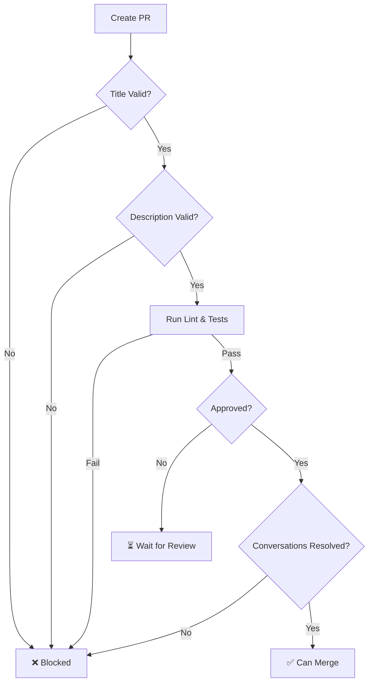

# Branch Protection Rules Configuration

This document outlines the recommended branch protection rules for this repository.

## 🔒 Recommended Settings

### For `main` branch:

1. **Require pull request reviews before merging**
   - Required approving reviews: **1**
   - Dismiss stale pull request approvals when new commits are pushed: ✅
   - Require review from Code Owners: ✅ (if CODEOWNERS file exists)

2. **Require status checks to pass before merging**
   - Require branches to be up to date before merging: ✅
   - Required status checks:
     - `Validate Pull Request`
     - `Run Linting and Tests`
     - `lint-and-test / Run ESLint`
     - `lint-and-test / Run tests`
     - `lint-and-test / Build`

3. **Require conversation resolution before merging**
   - All conversations must be resolved: ✅

4. **Require signed commits**
   - Optional but recommended for security

5. **Require linear history**
   - Prevent merge commits: ✅
   - Use squash or rebase merging

6. **Include administrators**
   - Enforce rules for administrators: ✅

7. **Restrict who can push to matching branches**
   - Optional: Limit to specific users/teams

8. **Allow force pushes**
   - Disabled: ❌

9. **Allow deletions**
   - Disabled: ❌

## 🚀 How to Enable Branch Protection

### Via GitHub UI:

1. Go to your repository on GitHub
2. Click **Settings** → **Branches**
3. Click **Add branch protection rule**
4. Enter branch name pattern: `main`
5. Configure settings as listed above
6. Click **Create** or **Save changes**

### Via GitHub CLI:

```bash
# Install GitHub CLI if not already installed
# https://cli.github.com/

# Enable branch protection
gh api repos/:owner/:repo/branches/main/protection \
  --method PUT \
  --field required_status_checks='{"strict":true,"contexts":["Validate Pull Request","Run Linting and Tests"]}' \
  --field enforce_admins=true \
  --field required_pull_request_reviews='{"required_approving_review_count":1,"dismiss_stale_reviews":true}' \
  --field restrictions=null \
  --field required_linear_history=true \
  --field allow_force_pushes=false \
  --field allow_deletions=false \
  --field required_conversation_resolution=true
```

## 📋 PR Validation Rules

The `.github/workflows/pr-validation.yml` workflow enforces the following:

### 1. PR Title Format
- Must follow conventional commits format
- Pattern: `type(scope): description`
- Valid types: `feat`, `fix`, `docs`, `style`, `refactor`, `perf`, `test`, `chore`, `ci`, `build`
- Description must start with uppercase letter

**Examples:**
```
✅ feat: add user authentication
✅ fix(auth): resolve login validation bug
✅ docs: update README with Docker instructions
❌ Add new feature (missing type)
❌ feat: add feature (lowercase description)
```

### 2. PR Description
- Minimum 50 characters
- Must use PR template with checkboxes
- At least one checkbox must be checked
- Should include:
  - Description of changes
  - Type of change
  - Testing checklist
  - Screenshots (if applicable)

### 3. PR Size
- Warning if changes exceed 1000 lines
- Auto-labeled with size:
  - `size/XS`: < 10 lines
  - `size/S`: < 50 lines
  - `size/M`: < 200 lines
  - `size/L`: < 500 lines
  - `size/XL`: ≥ 500 lines

### 4. Breaking Changes
- Detected from title (contains `!`) or description
- Must include migration guide if breaking changes present
- Auto-labeled with `breaking-change`

### 5. Required Checks
- ✅ ESLint must pass (0 errors, 0 warnings)
- ✅ Prettier check must pass
- ✅ All tests must pass
- ✅ Build must succeed

### 6. Auto-labeling
PRs are automatically labeled based on:
- Type (enhancement, bug, documentation, testing, maintenance)
- Size (XS, S, M, L, XL)
- Breaking changes

## 🔐 CODEOWNERS (Optional)

Create `.github/CODEOWNERS` to require reviews from specific people:

```
# Default owners for everything
* @yourusername

# Specific owners for different areas
/src/features/auth/ @auth-team
/docs/ @docs-team
*.md @docs-team
/.github/ @devops-team
```

## 🚫 What Gets Blocked

A PR **cannot be merged** if:

1. ❌ PR title doesn't follow conventional commits format
2. ❌ PR description is too short (< 50 characters)
3. ❌ PR template not used (no checkboxes)
4. ❌ No checkboxes are checked
5. ❌ Breaking changes without migration guide
6. ❌ ESLint fails
7. ❌ Prettier check fails
8. ❌ Tests fail
9. ❌ Build fails
10. ❌ No approving review (if required)
11. ❌ Unresolved conversations

## ✅ Merge Strategies

Recommended merge strategies:

1. **Squash and merge** (Recommended)
   - Keeps history clean
   - One commit per PR
   - Good for feature branches

2. **Rebase and merge**
   - Linear history
   - Preserves individual commits
   - Good for well-structured commits

3. **Create a merge commit**
   - Preserves full history
   - Shows when branches were merged
   - Can create messy history

**Configure in Settings → General → Pull Requests**

## 🔄 Workflow



## 📊 Monitoring

Check PR validation status:
- GitHub Actions tab shows all checks
- PR page shows required checks
- Red ❌ = Failed
- Yellow ⏳ = In progress
- Green ✅ = Passed

## 🛠️ Troubleshooting

### PR title validation fails
```bash
# Fix: Use conventional commits format
git commit --amend -m "feat: add new feature"
git push --force
```

### Description too short
- Edit PR description on GitHub
- Add more details about changes

### Lint/Test failures
```bash
# Run locally before pushing
npm run lint
npm run format
npm test
npm run build
```

### Need to bypass rules (emergency)
- Administrators can bypass if "Include administrators" is disabled
- Not recommended for normal workflow

---

**These rules ensure code quality and consistent PR standards across the project.**
